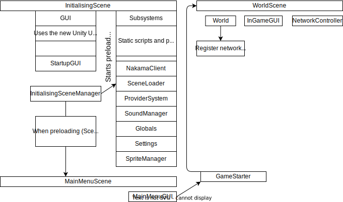

[The client](https://github.com/OpenHellion/Server) is the part of the project that the players interact with. It contains all of the graphical assets, handles rendering, and serves as an interface to the player.

As the diagram below shows, intialisation is handled by the InitialisingScene, which when has completed, sends the player over to the Main Menu Scnene. This scene then sends the player to the Client scene.

NB: The diagram shows as the game should be, and therefore does not reflect the current state of the codebase, but it is still similar to the current version of the game.

The client scene starts by initialising all of the dependencies it needs to start a game. It then follows on by getting the match it wants from the NakamaManager, and then joins that match to get connectionin

In addition to this, there also exists many scenes for the various structures and celestial objects in the game. These are loaded and cached on initialisation and fetched when they are to be used in the game.
