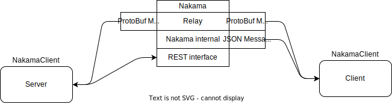
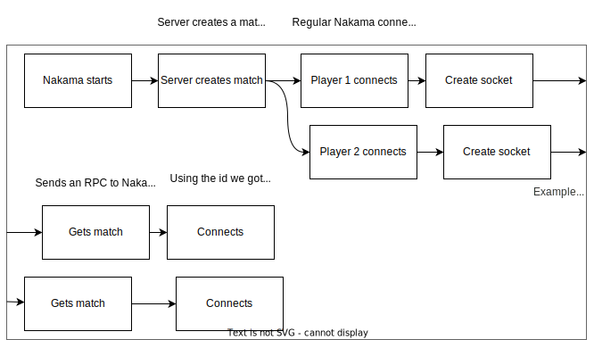

OpenHellion uses Nakama as a main server. The tasks the main server handles are: user accounts, friends, achievements (todo), match handling, chat, character info (todo), parties (todo), and notifications (todo). Later I wish to expand the tasks of the main server to include saving the world and more.

The components that handles networkconnectivity are located in the Net namespaces on the client and the server. In addition, the client has another namespace called social, which handles connections to Nakama. The server communicates with Nakama throught the MsCommunication class, located in the Net namespace.

The most important task of the main server is the facilitate the connections between the client and the game server. The game server handles the simulation of the world, which is the game you actually play. The messages are sent directly between the client and the server, with Nakama serving as a controller of all of the underlying servers.

Later, it might be interresting to see if we can add a relay layer on the server that can validate data and such.

As an example of how connections between the client and server is handled, we have the communications example graph. It walks us from the immediate connection, done right when you open the game, to the server creating match to join and to us connecting to it.

