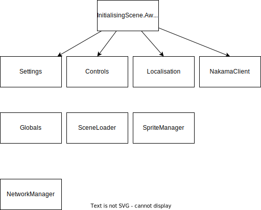

Subsystems are static classes and persistent game objects that run under the hood to provide supporting functions for gameplay-related code. The diaagram only shows the subsystems that are designed for OpenHellion, and does not take into consideration libraries and Unity subsystems.

The "settings" subsystem handles the underlying code and data required for changing the settings in-game.

The "controls" subsystem has the responsibility of keeping track of and storing key bindings as well as keeping track of input. Also has the possibility of making all bindings change at runtime.

"NakamaClient" handles the connections to the Nakama server. The Nakama server is what is also refered to as the main server, and has resposibility for accounts and multiplayer connections. This is further explained on the  page.
