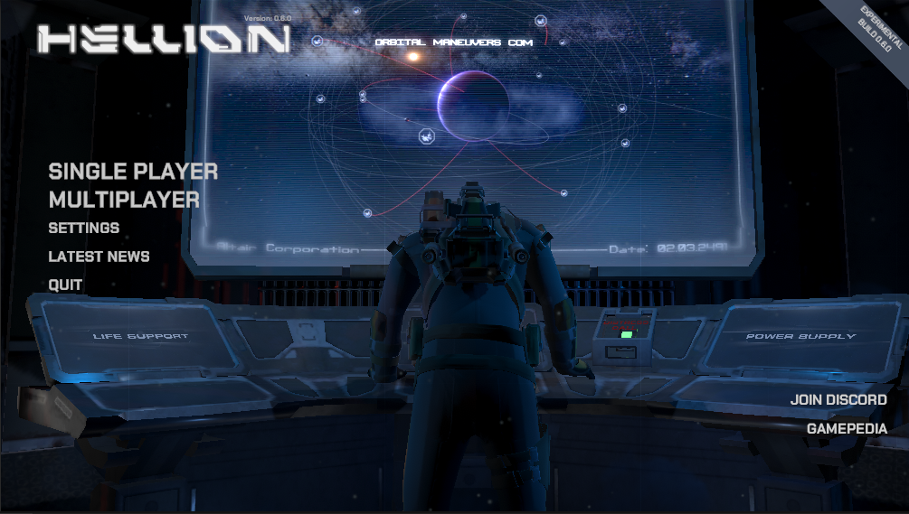

# OpenHellion Project
{: .align-center}

OpenHellion is a multiplayer game set in space. You're a part of a mission-gone-wrong to colonise the nearest star. The goal is to survive in space, and to do such you need to follow a series of quests; these will guide you through the core concepts of the game. The game is an open-world sandbox game, and allows you to build and manage your own space stations and ships.

The project is based based upon the no-longer-available Hellion game, made by the now defunct Serbian company Zero Gravity. It is unclear who the current rightholders of the game are. If you are the current rightholder; please contact me on discord (makkkkus) or by email (nygardboi (at) protonmail.com).

---

The game can be [downloaded at the client's GitHub repository](https://github.com/OpenHellion/Client) under Releases.

Visit the [Hellion Documentation](documentation/home) for a more technical introduction to the game.
